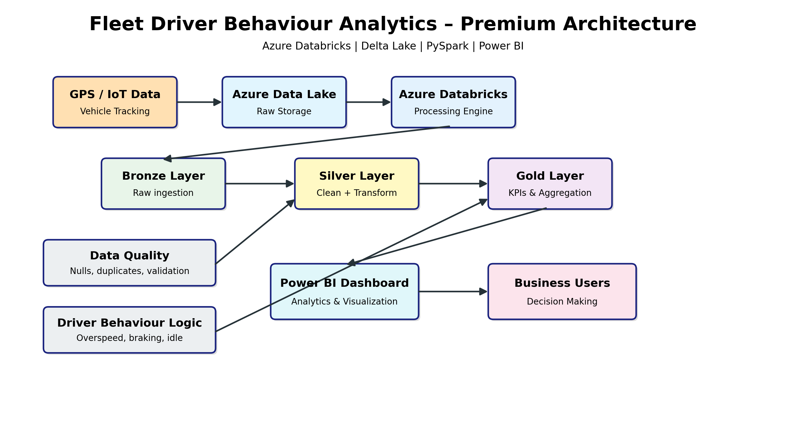
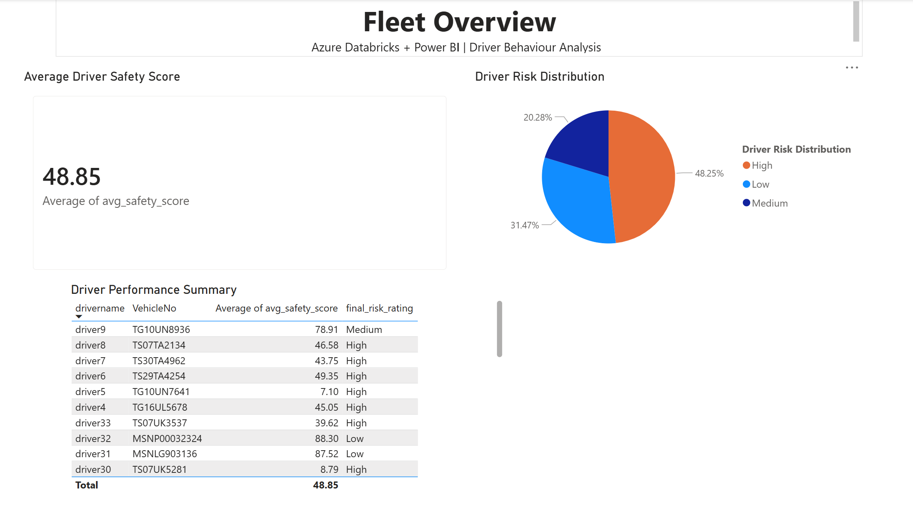
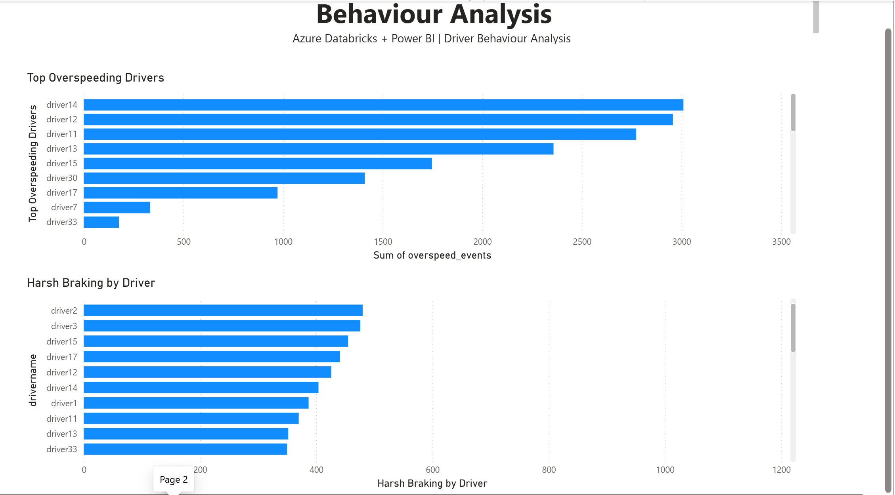

# 🚗 Fleet Driver Behaviour Analytics Pipeline

## 📌 Project Overview
This project analyzes fleet vehicle GPS data to evaluate **driver behaviour, safety, and risk levels** using modern data engineering and analytics tools.

It demonstrates an end-to-end pipeline from raw data ingestion to business insights using:

- Azure Databricks (PySpark)
- Delta Lake (Medallion Architecture)
- Power BI (Interactive Dashboard)
- Notion (Project Planning)

---

## 🧱 Architecture

The solution follows a Medallion Architecture:

- Bronze → Raw GPS data ingestion  
- Silver → Cleaned & enriched driver behaviour data  
- Gold → Business-ready KPIs and risk scoring  



---

## 🗂 Project Planning (Notion)

Project execution was managed using Notion:

- Epics & task breakdown  
- Daily progress tracking  
- Pipeline development stages  
- Dashboard development  

---

## 🔄 Data Pipeline

### 🟤 Bronze Layer
- Ingest raw GPS data (CSV / streaming)
- Add metadata columns:
  - `_ingest_ts`
  - `_source_file`

---

### ⚪ Silver Layer
- Data cleaning & validation
- Remove duplicates
- Handle null values
- Feature engineering:
  - Overspeed events
  - Harsh braking events
  - Harsh acceleration events
  - Idle time calculation

---

### 🟡 Gold Layer
- Driver-level aggregation
- Metrics generated:
  - Average safety score
  - Risk classification:
    - Low
    - Medium
    - High

---

## 📊 Dashboard Preview

### Fleet Overview


### Behaviour Analysis


---

## 📊 Power BI Dashboard Features

- 🚦 Driver Risk Distribution  
- 📈 Average Driver Safety Score (KPI)  
- 🚗 Driver Performance Summary  
- ⚠️ Top Overspeeding Drivers  
- 🛑 Harsh Braking Analysis  

Dashboard file:
```
dashboard/fleet_dashboard.pbix
```

---

## 📂 Project Structure

```
fleet-driver-analytics-pipeline/
│
├── notebooks/
│   ├── 01_bronze_ingestion.py
│   ├── 02_silver_data_cleaning.py
│   ├── 03_gold_aggregation.py
│
├── data/
│   └── sample_vehicle_data.csv
│
├── docs/
│   ├── architecture.png
│   ├── dashboard_overview.png
│   ├── dashboard_behaviour.png
│   └── data_description.md
│
├── dashboard/
│   └── fleet_dashboard.pbix
│
└── README.md
```

---

## 📊 Dataset

Sample dataset included:

```
data/sample_vehicle_data.csv
```

### Fields:
- VehicleId  
- VehicleNo  
- Latitude  
- Longitude  
- Location  
- Datetime  
- Speed  
- Ignition  
- Direction  
- GPSstatus  

> ⚠️ Full dataset (~500K+ records) not included due to size and privacy constraints.

---

## 🚀 How to Run

1. Upload sample data to Azure Data Lake / Databricks Volume  
2. Run notebooks in order:
   - Bronze → Silver → Gold  
3. Validate Gold tables  
4. Connect Power BI to Databricks  
5. Open `.pbix` dashboard  

---

## 🧠 Business Impact

- Identifies high-risk drivers based on behaviour patterns  
- Improves fleet safety monitoring  
- Enables data-driven decision-making  
- Provides actionable insights for fleet managers  

---

## 🛠 Tech Stack

- Azure Databricks  
- PySpark  
- Delta Lake  
- Power BI  
- Notion  

---

## 🚀 Future Improvements

- Real-time streaming ingestion
- Driver alert system
- ML-based risk prediction

## 👤 Author

**Sai Krishna Reddy**  
Aspiring Data Engineer | Cloud & Analytics Enthusiast  

📌 LinkedIn: https://www.linkedin.com/in/sai-krishna-reddy-k-14008b27a/  
📧 Email: saikrishnareddy478@gmail.com  
💼 Open to Data Engineer roles in Canada  

---

## ⭐ Support

If you found this project useful, give it a ⭐ on GitHub!
